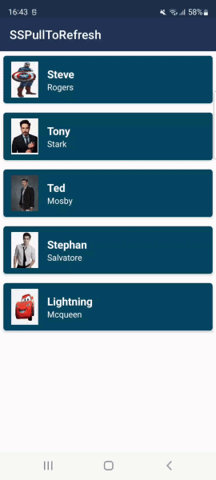
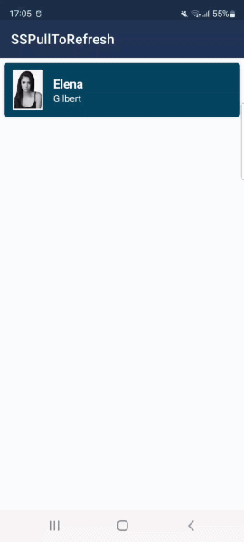
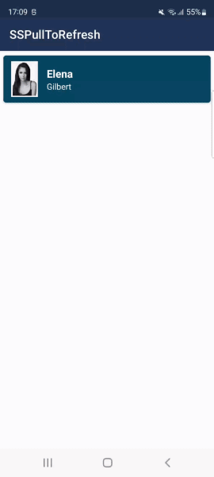
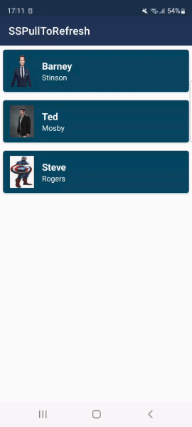
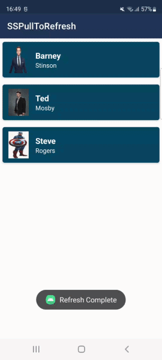
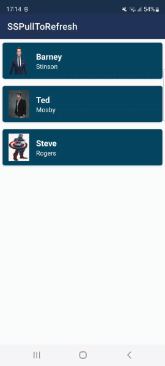
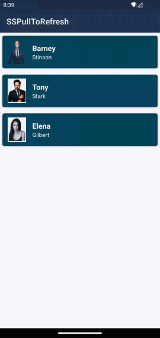
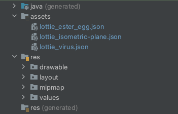

<a href="https://www.simform.com/"></a>
# SSPullToRefresh
## Pull to Refresh with custom animations
[](https://jitpack.io/#SimformSolutionsPvtLtd/SSPullToRefresh) [](https://kotlinlang.org)  [](https://www.android.com/) [](https://android-arsenal.com/api?level=17)

SSPullToRefresh makes PullRefresh easy to use, you can provide your own custom animations or set simple gifs on refresh view.
The best feature is Lottie animations in refresh view, it uses lottie animations to render high quality animations on pull refresh.

## Features

- Simple and easy to use (no complex animations to deal with)
- Customize the animation view by providing your own custom interactive RefreshViews (need to implement [RefreshCallbacks][RefreshCallbacksFile])
- Set Gif animations in refresh view
- Import lottie json in assets folder and apply animation (as simple as that)
- Customize repeatMode, repeatCount and Interpolator on different points of animations

# 🎬 Preview

| Default refreshView | Gif animation | Wave animation (Custom class) |
|--|--|--|
|  | <a href="sspulltorefresh/src/main/java/com/simform/refresh/SSPullToRefreshLayout.kt#L227"></a> | <a href="app/src/main/java/com/simform/demo/WaveAnimation.kt"></a> |

| Lottie animation 1 | Lottie animation 2 |  Lottie animation 3  |
|--|--|--|
| <a href="sspulltorefresh/src/main/java/com/simform/refresh/SSPullToRefreshLayout.kt#L218"></a> | <a href="sspulltorefresh/src/main/java/com/simform/refresh/SSPullToRefreshLayout.kt#L218"></a> | <a href="sspulltorefresh/src/main/java/com/simform/refresh/SSPullToRefreshLayout.kt#L218"></a> |

| Custom view with user interactions |
|--|
| <a href="app/src/main/java/com/simform/demo/CustomView.kt"></a> |

# How it works:

1. Gradle Dependency

- Add the JitPack repository to your project's build.gradle file

```groovy
allprojects {
    repositories {
        maven { url 'https://jitpack.io' }
    }
}
```
- With the newer android studio project structure you will need to define the jitpack url in settings.gradle instead of build.gradle

```groovy
dependencyResolutionManagement {
    repositories {
        maven { url 'https://jitpack.io' }
    }
}
```

- Add the dependency in your app's build.gradle file

```groovy
dependencies {
    implementation 'com.github.SimformSolutionsPvtLtd:SSPullToRefresh:1.5.2'
}
```
2. Wrap your refreshing view (RecyclerView, listView etc..) with SSPullToRefreshLayout
```xml
<com.simform.refresh.SSPullToRefreshLayout
    android:id="@+id/ssPullRefresh"
    android:layout_width="match_parent"
    android:layout_height="match_parent"
    app:layout_constraintBottom_toBottomOf="parent"
    app:layout_constraintEnd_toEndOf="parent"
    app:layout_constraintStart_toStartOf="parent"
    app:layout_constraintTop_toTopOf="parent">

    <androidx.recyclerview.widget.RecyclerView
        android:id="@+id/rv"
        android:layout_width="match_parent"
        android:layout_height="wrap_content"
        app:layout_constraintBottom_toBottomOf="parent"
        app:layout_constraintEnd_toEndOf="parent"
        app:layout_constraintStart_toStartOf="parent"
        app:layout_constraintTop_toTopOf="parent" />

</com.simform.refresh.SSPullToRefreshLayout>
```
3. Set OnRefreshListener on SSPullToRefreshLayout and you are good to go 👍
```kotlin
ssPullRefresh.setOnRefreshListener {
   CoroutineScope(Dispatchers.Main).launch {
      delay(2000)
      ssPullRefresh.setRefreshing(false) // This stops refreshing
      mAdapter.randomizeData()
      Toast.makeText(
         this@MainActivity,
         "Refresh Complete",
         Toast.LENGTH_SHORT
      ).show()
   }
}
```

# To customize SSPullToRefreshLayout:

* To customize SSPullToRefreshLayout, you can set a different lottie animation of your choice
* you need to have .json file of your lottie animations in assets folder of your app module



```kotlin
ssPullRefresh.setLottieAnimation("lottie_isometric-plane.json")
```
* To customize repeatMode and repeatCount of animation.
```kotlin
ssPullRefresh.setRepeatMode(SSPullToRefreshLayout.RepeatMode.REPEAT)
ssPullRefresh.setRepeatCount(SSPullToRefreshLayout.RepeatCount.INFINITE)
```
* To change refresh style.
```kotlin
ssPullRefresh.setRefreshStyle(SSPullToRefreshLayout.RefreshStyle.NORMAL)
```
* To customize the whole refresh view you need to inherit SSAnimationView for your custom class and override the methods needed

  Here is an example class
  [WaveAnimation][WaveAnimationFile].
* Provide your CustomView by setRefreshView() method
```kotlin
ssPullRefresh.setRefreshView(WaveAnimation(this))
```
* Provide layoutParams if you need to change RefreshView height/width
```kotlin
ssPullRefresh.setRefreshViewParams(
   ViewGroup.LayoutParams(
      ViewGroup.LayoutParams.MATCH_PARENT,
      300
   )
)
```
* Set Gif animation just by using setGifAnimation method (This can only be done on SSAnimationView)
```kotlin
ssPullRefresh.setGifAnimation(R.raw.bird)
```

# Other Library used:
* [Lottie][lottie-repo-url]
* [android-gif-drawable][gif-lib-repo]

### Credits:
- This library was inspired by __[RecyclerRefreshLayout]__

## Find this library useful? ❤️
Support it by joining __[stargazers]__ for this repository.⭐

## 🤝 How to Contribute

Whether you're helping us fix bugs, improve the docs, or a feature request, we'd love to have you! 💪
Check out our __[Contributing Guide]__ for ideas on contributing.


# iOS Library:
* Check our iOS Library also - [SSCustomPullToRefresh][SSCustomPullToRefresh]

## Bugs and Feedback

For bugs, feature requests, and discussion please use __[GitHub Issues]__.

## Awesome Mobile Libraries
- Check out our other available [awesome mobile libraries](https://github.com/SimformSolutionsPvtLtd/Awesome-Mobile-Libraries)

## License

```
MIT License

Copyright (c) 2022 Simform Solutions

Permission is hereby granted, free of charge, to any person obtaining a copy
of this software and associated documentation files (the "Software"), to deal
in the Software without restriction, including without limitation the rights
to use, copy, modify, merge, publish, distribute, sublicense, and/or sell
copies of the Software, and to permit persons to whom the Software is
furnished to do so, subject to the following conditions:

The above copyright notice and this permission notice shall be included in all
copies or substantial portions of the Software.

THE SOFTWARE IS PROVIDED "AS IS", WITHOUT WARRANTY OF ANY KIND, EXPRESS OR
IMPLIED, INCLUDING BUT NOT LIMITED TO THE WARRANTIES OF MERCHANTABILITY,
FITNESS FOR A PARTICULAR PURPOSE AND NONINFRINGEMENT. IN NO EVENT SHALL THE
AUTHORS OR COPYRIGHT HOLDERS BE LIABLE FOR ANY CLAIM, DAMAGES OR OTHER
LIABILITY, WHETHER IN AN ACTION OF CONTRACT, TORT OR OTHERWISE, ARISING FROM,
OUT OF OR IN CONNECTION WITH THE SOFTWARE OR THE USE OR OTHER DEALINGS IN THE
SOFTWARE.
```

[//]: # (These are reference links used in the body of this note and get stripped out when the markdown processor does its job. There is no need to format nicely because it shouldn't be seen. Thanks SO - http://stackoverflow.com/questions/4823468/store-comments-in-markdown-syntax)

  [git-repo-url]: <https://github.com/SimformSolutionsPvtLtd/SSPullToRefresh.git>
  [lottie-repo-url]: <https://github.com/airbnb/lottie-android.git>
  [stargazers]: <https://github.com/SimformSolutionsPvtLtd/SSPullToRefresh/stargazers>
  [Contributing Guide]: <https://github.com/SimformSolutionsPvtLtd/SSPullToRefresh/blob/main/CONTRIBUTING.md>
  [GitHub Issues]: <https://github.com/SimformSolutionsPvtLtd/SSPullToRefresh/issues>
  [RecyclerRefreshLayout]: <https://github.com/dinuscxj/RecyclerRefreshLayout?utm_source=android-arsenal.com&utm_medium=referral&utm_campaign=3383>
  [gif-lib-repo]: <https://github.com/koral--/android-gif-drawable.git>
  [SSCustomPullToRefresh]: <https://github.com/SimformSolutionsPvtLtd/SSCustomPullToRefresh.git>
  [WaveAnimationFile]: app/src/main/java/com/simform/pulltorefresh/WaveAnimation.kt
  [RefreshCallbacksFile]: sspulltorefresh/src/main/java/com/simform/refresh/RefreshCallbacks.kt