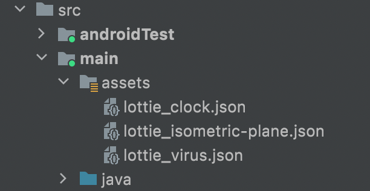

<a href="https://www.simform.com/"></a>
# SSPullToRefresh
## Pull to Refresh with custom animations
[][git-repo-url] [](https://jitpack.io/#SimformSolutionsPvtLtd/SSPullToRefresh) [](https://kotlinlang.org)  [](https://www.android.com/) [](https://android-arsenal.com/api?level=17)

SSPullToRefresh makes PullRefresh easy to use, you can provide your own custom animations or set simple gifs on refresh view.
The best feature is Lottie animations in refresh view, it uses lottie animations to render high quality animations on pull refresh.

## Features

- Simple and easy to use ( no complex animations to deal with )
- Customize the animation view by providing your own custom RefreshView (need to subclass SSAnimationView)
- Set Gif animations in refresh view
- Import lottie json in assets folder and apply animation ( as simple as that )
- Customize repeateMode, repeateCount and Interpolators on different points of animations

# 🎬 Preview

| Default refreshView | Lottie animation 1 | Lottie animation 2 |
|--|--|--|
|  |  |  |

| Wave animation (Custom class) | Gif animation |
|--|--|
|  | |

# How it works:

1. Gradle Dependency

- Add the JitPack repository to your project's build.gradle file

```groovy
    allprojects {
        repositories {
            ...
    	    maven { url 'https://jitpack.io' }
        }
    }
```
- Add the dependency in your app's build.gradle file

```groovy
    dependencies {
        implementation 'com.github.SimformSolutionsPvtLtd:SSPullToRefresh:1.2'
    }
```
2. Wrap your refreshing view ( RecyclerView, listView etc..) with SSPullToRefreshLayout
```xml
    <com.simform.refresh.SSPullToRefreshLayout
        android:id="@+id/ssPullRefresh"
        android:layout_width="match_parent"
        android:layout_height="match_parent"
        app:layout_constraintBottom_toBottomOf="parent"
        app:layout_constraintEnd_toEndOf="parent"
        app:layout_constraintStart_toStartOf="parent"
        app:layout_constraintTop_toTopOf="parent">

        <androidx.recyclerview.widget.RecyclerView
            android:id="@+id/rv"
            android:layout_width="match_parent"
            android:layout_height="wrap_content"
            app:layout_constraintBottom_toBottomOf="parent"
            app:layout_constraintEnd_toEndOf="parent"
            app:layout_constraintStart_toStartOf="parent"
            app:layout_constraintTop_toTopOf="parent" />

    </com.simform.refresh.SSPullToRefreshLayout>
```
3. Set OnRefreshListener on SSPullToRefreshLayout and you are good to go 👍
```kotlin
    ssPullRefresh.setOnRefreshListener(object : SSPullToRefreshLayout.OnRefreshListener {
        override fun onRefresh() {
            // This is demo code to perform
            GlobalScope.launch {
                delay(3000)
                ssPullRefresh.setRefreshing(false) // This line stops layout refreshing
                MainScope().launch {
                    Toast.makeText(this@MainActivity,"Refresh Complete",Toast.LENGTH_SHORT).show()
                }
            }
        }
    })
```

# To customize SSPullToRefreshLayout:

* To customize SSPullToRefreshLayout, you can set a different lottie animation of your choice
* you need to have .json file of you lottie animations in assets forlder of you app module


```kotlin
    ssPullRefresh.setLottieAnimation("lottie_isometric-plane.json")
```
* To customize repeadtMode and repeatCount of animation.
```kotlin
    ssPullRefresh.setRepeatMode(SSPullToRefreshLayout.RepeatMode.REPEAT)
    ssPullRefresh.setRepeatCount(SSPullToRefreshLayout.RepeatCount.INFINITE)
```
* To change refresh style.
```kotlin
    ssPullRefresh.setRefreshStyle(SSPullToRefreshLayout.RefreshStyle.NORMAL)
```
* To customize the whole refresh view you need to inherit SSAnimationView for your custom class and override the methods needed
```kotlin
    class WaveAnimation(context: Context): SSAnimationView(context) {
        private var amplitude = 22f.toDp() // scale
        private var speed = 0f
        private val path = Path()
        private var paint = Paint(Paint.ANTI_ALIAS_FLAG)
        private var animator: ValueAnimator? = null

        override fun onDraw(c: Canvas) = c.drawPath(path, paint)

        private fun createAnimator(): ValueAnimator {
            return ValueAnimator.ofFloat(0f, Float.MAX_VALUE).apply {
                repeatCount = ValueAnimator.INFINITE
                addUpdateListener {
                    speed -= WAVE_SPEED
                    createPath()
                    invalidate()
                }
            }
        }

        private fun createPath() {
            path.reset()
            paint.color = Color.parseColor("#203354")
            path.moveTo(0f, height.toFloat())
            path.lineTo(0f, amplitude)
            path.lineTo(0f, amplitude - 10)
            var i = 0
            while (i < width + 10) {
                val wx = i.toFloat()
                val wy = amplitude * 2 + amplitude * sin((i + 10) * Math.PI / WAVE_AMOUNT_ON_SCREEN + speed).toFloat()
                path.lineTo(wx, wy)
                i += 10
            }
            path.lineTo(width.toFloat(), height.toFloat())
            path.close()
        }

        override fun onDetachedFromWindow() {
            animator?.cancel()
            super.onDetachedFromWindow()
        }

        companion object {
            const val WAVE_SPEED = 0.25f
            const val WAVE_AMOUNT_ON_SCREEN = 350
        }

        private fun Float.toDp() = this * context.resources.displayMetrics.density

        override fun reset() {
        }

        override fun refreshing() {
        }

        override fun refreshComplete() {
            animator?.cancel()
        }

        override fun pullToRefresh() {
            animator = createAnimator().apply {
                start()
            }
        }

        override fun releaseToRefresh() {
        }

        override fun pullProgress(pullDistance: Float, pullProgress: Float) {
        }
}
```
* Provide your CustomView by setRefreshView() method
```kotlin
        ssPullRefresh.setRefreshView(WaveAnimation(this))
```
* Provide layoutParams if you need to channge RefreshView height/width
```kotlin
         ssPullRefresh.setRefreshViewParams(ViewGroup.LayoutParams(ViewGroup.LayoutParams.MATCH_PARENT,300))
```
* Set Gif animation just by using setGifAnimation method ( This can only be done on SSAnimationView )
```kotlin
         ssPullRefresh.setGifAnimation(R.raw.bird)
```

# Other Library used:
* [Lottie][lottie-repo-url]
* [android-gif-drawable][gif-lib-repo]

### Credits:
- This library was inspired by __[RecyclerRefreshLayout]__

## Find this library useful? ❤️
Support it by joining __[stargazers]__ for this repository.⭐

## 🤝 How to Contribute

Whether you're helping us fix bugs, improve the docs, or a feature request, we'd love to have you! 💪
Check out our __[Contributing Guide]__ for ideas on contributing.


# iOS Library:
* Check our iOS Library also - [SSCustomPullToRefresh][SSCustomPullToRefresh]

## Bugs and Feedback

For bugs, feature requests, and discussion please use __[GitHub Issues]__.

## License

```
Copyright 2021 Simform Solutions

 Licensed under the Apache License, Version 2.0 (the "License");
 you may not use this file except in compliance with the License.
 You may obtain a copy of the License at
    http://www.apache.org/licenses/LICENSE-2.0
 Unless required by applicable law or agreed to in writing, software
 distributed under the License is distributed on an "AS IS" BASIS,
 WITHOUT WARRANTIES OR CONDITIONS OF ANY KIND, either express or implied.
 See the License for the specific language governing permissions and limitations under the License.
```

[//]: # (These are reference links used in the body of this note and get stripped out when the markdown processor does its job. There is no need to format nicely because it shouldn't be seen. Thanks SO - http://stackoverflow.com/questions/4823468/store-comments-in-markdown-syntax)

   [git-repo-url]: <https://github.com/SimformSolutionsPvtLtd/SSPullToRefresh.git>
   [lottie-repo-url]: <https://github.com/airbnb/lottie-android.git>
   [stargazers]: <https://github.com/SimformSolutionsPvtLtd/SSPullToRefresh/stargazers>
   [Contributing Guide]: <https://github.com/SimformSolutionsPvtLtd/SSPullToRefresh/blob/main/CONTRIBUTING.md>
   [GitHub Issues]: <https://github.com/SimformSolutionsPvtLtd/SSPullToRefresh/issues>
   [RecyclerRefreshLayout]: <https://github.com/dinuscxj/RecyclerRefreshLayout?utm_source=android-arsenal.com&utm_medium=referral&utm_campaign=3383>
   [gif-lib-repo]: <https://github.com/koral--/android-gif-drawable.git>
   [SSCustomPullToRefresh]: <https://github.com/SimformSolutionsPvtLtd/SSCustomPullToRefresh.git>
